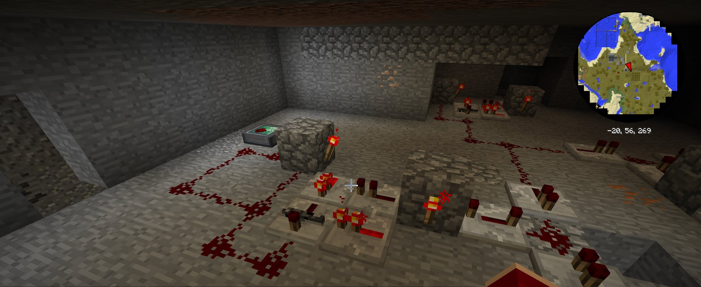

# MCTurtles
This was made to remember the complex systems that I made in the game
to help with creating rockets across the modded game pack I made.
Lua Code for Turtles in Mod MC, to re-supply resources
Link to Pack I Made for me and Friend [ModPack](https://www.technicpack.net/modpack/raisin-bread.1201315)

## Examples
A. Redstone brain for Food farming  
1. Wire Overview

2. Wire Function Output

3. Block_Coding 

B. Food Farm  
1. Seed Overview

2. Seed Controller Setup Area

3. Seed Controller Code 

C. Tree Farm  
1. Farm Overview

2. Farm Controller Setup Area

3. Farm Controller Code 

## Built With
* Minecraft Redstone
* Minecraft Forge Mods
* Computer Craft Tweaked
* RFTools
* Refined Storage

## Author
Project Designed by - Bailey Heck

## Acknowledgments
Project idea - Bailey Heck

## Key Programming Concepts Utilized
I have utilized electrical wiring techniques, 
that are further expressed in programing  
  
Also Performed Block Programing with RFTools to manage,  
incompatible in-Game Storage systems.  
  
Had to draw diagrams for the redstone wiring diagrams  
that needed to perform the actions.  
   
Shows that I can adapt to diffrent systems to accomplish a task  
that is needed with multiple systems.
